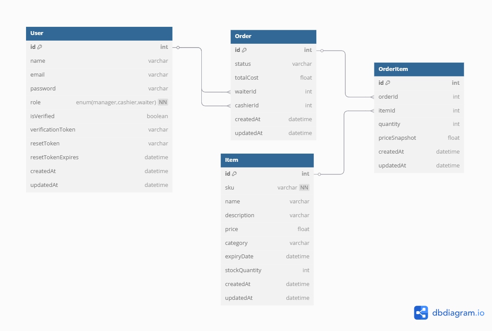

# 📦 geekyair-backend

---

## 📋 Project Progress

See what has been completed in [STATUS.md](./STATUS.md) 


---

## 🧾 Project Structure

```
geekyair-backend/
├── app.js                      # Main Express server entry point
├── config/                     # Sequelize config and other app configurations
├── controllers/                # Business logic for each route (e.g., user, item, order)
├── jobs/                       # Scheduled jobs (e.g., expiry checks)
├── middlewares/                # Middleware functions (auth, validation, uploads)
├── migrations/                 # Sequelize migration files
├── models/                     # Sequelize models (User, Item, Order, etc.)
├── node_modules/               # Project dependencies
├── routes/                     # API route definitions
├── scripts/                    # Utility or CLI scripts (e.g., seeders, clear Database)
├── test-data/                  # Sample/mock files for testing (e.g., CSV upload)
│   └── items.csv               # Sample CSV import file for item upload testing
├── utils/                      # Utility functions (e.g., validators, JWT, mailers)
├── .env.example                # Template environment file
├── .gitignore                  # Specifies intentionally untracked files to ignore
├── docker-compose.yml          # Docker Compose configuration for local dev
├── Dockerfile                  # Instructions to build the Docker image
├── package.json                # Project metadata, scripts, and dependencies
├── README.md                   # Main project documentation
├── SETUP.md                    # Developer setup instructions for testing
├── postman                     # postman environment and collection for testing
└── STATUS.md                   # Project status  / This file outlines the features and tasks completed 

```

---
## 🗂️ Database Schema

You can view the database structure in the diagram below:



---

## 🚀 Quick Start

This project is not deployed online. To test it locally, follow the setup instructions in the [`SETUP.md`](./SETUP.md) file.

